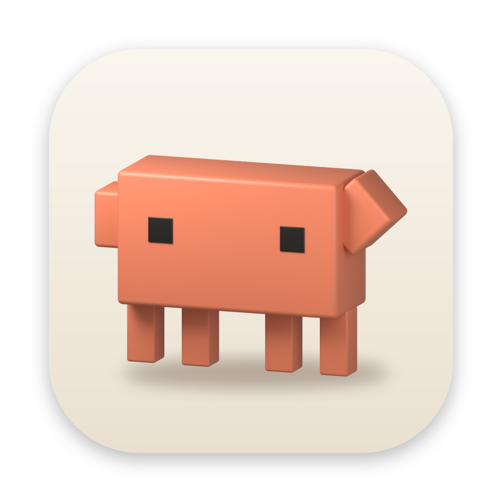
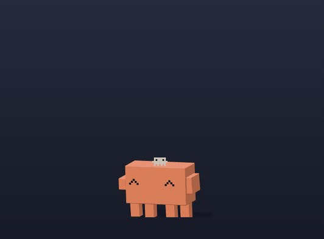
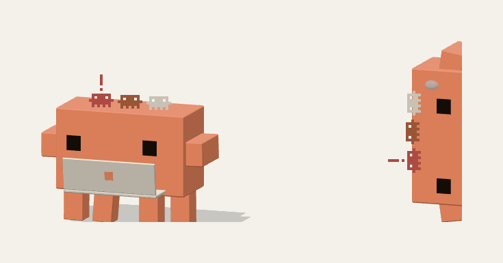
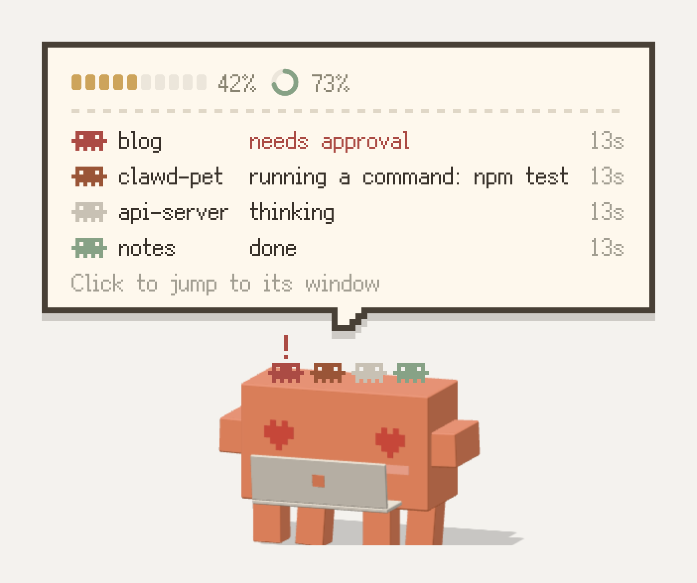
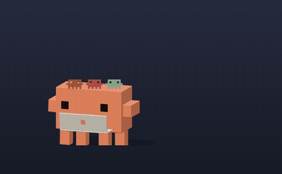
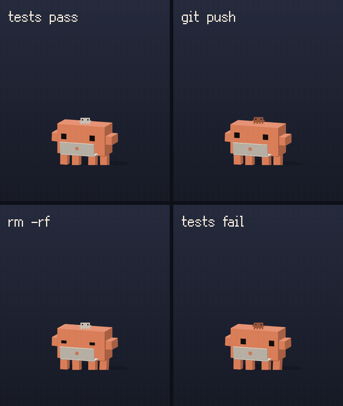

<p align="center">
  
</p>

<h1 align="center">Clawd Pet</h1>

<p align="center">
  <b>macOS のデスクトップに住み、Claude Code を見守ってくれる小さな 3D Clawd。</b><br>
  頭の上にセッションを乗せ、Claude があなたを必要とすると肩をたたき、テストが通れば大喜び。<br>
  残りのクォータも教えてくれます —— しかも作業の邪魔は一切しません。
</p>

<p align="center">
  
  
  
  
  <a href="LICENSE"></a>
</p>

<p align="center"><a href="README.md">English</a> · <a href="README.zh-CN.md">简体中文</a> · <b>日本語</b></p>

<p align="center"></p>

## なぜ Clawd？

Claude Code のセッションをいくつか走らせて別の作業に移ったら……そのうちの 1 つが 20 分間ずっとあなたの承認を待っていた。Clawd はそんな状況を解決します。しかも、かなりかわいく。

<table>
<tr><td width="230">🦀 <b>セッションが頭の上に</b></td><td>実行中の Claude Code セッションは、それぞれ小さなピクセルのカニになって Clawd の頭に乗ります。赤くて <code>!</code> が付いているカニはあなたを待っています。Clawd にカーソルを合わせると全セッションが見られます。<b>カニをクリックすると、そのターミナルのタブへ直接ジャンプ。</b></td></tr>
<tr><td width="230">✋ <b>デスクトップから承認</b></td><td>Claude がツールを使いたいとき、Clawd の上に出る吹き出しで承認できます —— <kbd>⌥⌘Y</kbd> / <kbd>⌥⌘N</kbd> を押すだけでも OK。</td></tr>
<tr><td width="230">🔋 <b>クォータがひと目でわかる</b></td><td>ピクセルの HP バーが 5 時間クォータと週間クォータを表示。Clawd の機嫌もそれに連動し、余裕があれば元気いっぱい、残り少ないと眠そうになります。</td></tr>
<tr><td width="230">🎉 <b>作業にリアクション</b></td><td>テストが通れば紙吹雪、<code>git push</code> でロケットジャンプ、<code>rm -rf</code> の前にはブルブル震えます。</td></tr>
<tr><td width="230">💤 <b>留守中のまとめ</b></td><td>席を外すと Clawd はお昼寝。戻ってきたら、見逃したことを教えてくれます。</td></tr>
<tr><td width="230">🪶 <b>決して邪魔しない</b></td><td>クリックはそのまま背後に通り抜け、キーボードのフォーカスを奪うこともなく、バッテリーにも優しい設計です。</td></tr>
</table>

すべてローカルで動作します。Clawd は**ログイン情報を一切読み取りません**。クォータの確認も**モデルを呼び出さず、クォータを消費しません**。

## クイックスタート

Apple シリコン搭載の macOS と、[Claude Code](https://code.claude.com) CLI（サインイン済み —— クォータ確認に使います）が必要です。

### ダウンロード

1. [最新リリース](https://github.com/195286381/clawd-pet/releases/latest) から `Clawd-<バージョン>-macos-arm64.zip` をダウンロードして解凍し、`Clawd.app` を**アプリケーション**フォルダに移動します
2. アプリは Apple の公証を受けていないため、macOS に「壊れている」「開けません」と表示されることがあります。ターミナルで一度だけ次を実行してください：
   ```bash
   xattr -dr com.apple.quarantine /Applications/Clawd.app
   ```
3. Clawd を開きます

### ソースからビルド

[Node.js](https://nodejs.org) も必要です。

```bash
git clone https://github.com/195286381/clawd-pet.git
cd clawd-pet/clawd-pet
npm install
npm run package && ditto dist/Clawd-darwin-arm64/Clawd.app /Applications/Clawd.app
open /Applications/Clawd.app
```

> 自分でビルドしたアプリも署名されていません。ビルドした Mac ではそのまま動きます。別の Mac にコピーした場合は、初回のみ右クリックして**開く**を選んでください。

インストールせずに試したい場合は、`clawd-pet/` の中で `npm start` を実行してください。

### 初期設定

Clawd のメニュー（メニューバーのアイコンを右クリック）から：

1. **Claude Code → Connect Claude Code (task alerts)** —— 新しく開始したセッションでカニ、通知、リアクションが有効になります
2. **Settings → Launch at login** —— Clawd がいつもそばにいるように
3. 任意：**Claude Code → Approve permissions on Clawd**

> **言語について：** Clawd の UI は**英語**と**簡体字中国語**に対応しています（日本語には未対応）。システム言語に従い、**Language / 语言** メニューからいつでも切り替えられます。このドキュメントのメニュー名は英語 UI の表記です。

---

## Claude Code との連携

### セッションガニ

<p align="center"></p>

アクティブな Claude Code セッションは、それぞれ Clawd の頭に乗ったピクセルのカニになります（最大 4 匹。それ以上はセッションごとに状態の色のピクセルの点で表示）。あなたを待っているセッションが先頭に並びます。

| カニ | 意味 |
|---|---|
| グレー | 考え中 |
| 赤茶色で、軽く揺れている | 作業中 |
| 赤くてピクセルの `!` 付き、ぴょんぴょん跳ねる | 承認待ち / 返信待ち |
| 緑 | 完了したところ |
| 赤 | エラーで停止 |

カニの太さはそのセッションのコンテキスト使用量を表します。自動コンパクトまでの 75% で一回り太り、90% でさらに太って汗をかきます（カーソルを合わせると割合が表示されます）。自動コンパクトの位置は `CLAUDE_CODE_AUTO_COMPACT_WINDOW` を設定していればそれに従います。

Claude がサブエージェント（Agent / Task）を出すと、そのセッションのカニが半分サイズの小さなカニを背中に乗せ、2 匹以上なら横にピクセル数字「×2」「×3」が付きます。数はセッションボックスにも表示されます（例：「· 4 subagents」）。返信が終わると全員戻ってきます。

- Clawd またはカニに**カーソルを合わせる**と、セッションの枠が開きます。頭上のカニと同じセッション（作業中・あなた待ち、完了またはエラーから 1 分以内のもの）のタイトル（Claude アプリのサイドバーの名前や /rename で付けた名前。ない場合はプロジェクトのフォルダ名）、作業内容、経過時間が表示されます。各行の先頭には状態と同じ色のピクセルのカニ、最上段にはクォータが入ります。セッションが一つもないときはクォータバーだけ、Clawd を持ち上げている間は何も出ません。Clawd が何か話している最中なら、その吹き出しは枠が開いている間いったん引っ込み、枠を閉じると続きを表示します。
- 見ている間、Clawd はその場にとどまります。カーソルを枠の中に動かすと、指している行のカニが持ち上がってぴょんぴょん跳ねます。

<p align="center"></p>

- **カニ、または枠の中の行をクリック**すると（点で表示されたセッションも含む）そのセッションへジャンプ：iTerm / Terminal は該当するタブに切り替わります（macOS が初回だけ「オートメーション」の許可を求めます）。Claude アプリはそのセッションを直接開きます。VS Code、Ghostty などはアプリが最前面に来ます。Clawd を接続する前に開始したセッションは、一度開き直す必要があります。
- **<kbd>⌃⌥⌘C</kbd> を押す**とマウスなしでセッションボックスを開けます：<kbd>↑</kbd> <kbd>↓</kbd> で選び、<kbd>⏎</kbd> でジャンプ、<kbd>Esc</kbd> かもう一度押すと閉じます。15 秒キー操作がなければ自動で閉じます。矢印キーと Return はボックスが開いている間だけ使います。メニュー **Claude Code → ⌃⌥⌘C opens session list** でオフにできます
- **Clawd を再起動**しても（アップデート、ログイン時の起動）作業中のセッションは消えません：起動時に直近 30 分以内に書かれたセッション記録を読み、ツール実行中や考え中のセッションを頭の上に戻します。戻ったカニは次のイベントが届くまで、クリックしてもアプリが最前面に来るだけです。
- 完了したカニとエラーのカニは 1 分後に去っていきます —— ただ消えるわけではありません：

<p align="center"></p>

完了したカニは飛び降りて手を振り、歩き去ります。エラーのカニはひっくり返ってジタバタしてから去っていきます。暇なとき、Clawd はときどきしゃがんで頭の上のカニを弾ませます。画面端にしがみついているときは、カニも一緒に向きを変えます。

### 通知

**新しく開始した** Claude Code セッションで：

- **Claude が作業中** —— Clawd が小さなノートパソコンを取り出して一緒に作業します。独り言で Claude の作業内容を教えてくれます（例：「Claude is running a command: npm test…」）
- **返信が完了**（15 秒以上かかったタスク）—— Clawd がジャンプして、プロジェクト名とともに「Claude is done ✅」と報告
- **Claude が承認を求めている / あなたを待っている / 質問がある** —— Clawd が手を振ります（例：「🙋 Wants to use Bash — needs your approval」）
- **まだ待っている** —— 3 分後にもう一度手を振り、その後 5 分ごと、最大 3 回まで
- **ツール呼び出しの失敗** —— Clawd が一瞬 `x x` の顔になります（吹き出しは出ません。小さな失敗はよくあることなので）
- **Claude がエラーで停止** —— Clawd が泣きながら「⚠️ Claude stopped with an error」と伝えます
- **コンテキストがもうすぐいっぱい**（90%）—— セッションごとに 1 回：「🦀 Context is almost full (92%), auto-compact is coming」
- **コンテキストのコンパクト中** —— Clawd の頭上に開いた段ボール箱が現れ、紙が次々と飛び込みます。終わると箱にテープが貼られ、Clawd がぴょんと跳ね、太ったカニが元に戻ります
- **留守中のまとめ** —— 5 分間操作がないと Clawd は横になって眠ります。戻ってくると見逃したことをまとめてくれます（例：「While you were away: 🙋 api-server needs your approval (waiting 12 min) / ✅ clawd finished」）
- **いくつも続けて届いたとき** —— 続けて届いた通知は 1 つの吹き出しにまとめて縦に並べます。承認の吹き出しが開いている間に届いた通知は、あなたが答えてからまとめて表示します

### リアクション

<p align="center"></p>

| Claude が実行したもの | Clawd の反応 |
|---|---|
| 成功したテスト（`npm test`、`pytest`、`go test`、`cargo test` など） | 星の目でジャンプして紙吹雪 |
| 失敗したテスト | 泣き顔でうなだれる |
| 成功した `git push` | 煙を上げてロケットのように飛び上がる |
| `rm -rf` | 震えて冷や汗 |

同じリアクションは 15 秒に 1 回まで。画面端にしがみついているとき、寝ているとき、ドラッグ中は反応しません。

### Clawd で権限を承認する

デフォルトではオフです。**Claude Code → Approve permissions on Clawd** でオンにすると、それ以降に開いたセッションに適用されます。

Claude がツールの使用に承認を必要とし、そのセッションのウィンドウが最前面にない場合、Clawd がプロジェクトとツール（Bash の場合はコマンド全体）を表示した吹き出しを出し、**Allow / Deny / Go to terminal** を選べます。<kbd>⌥⌘Y</kbd> で許可、<kbd>⌥⌘N</kbd> で拒否（これらのキーはリクエストを待っている間だけ使われます）。Claude Code がルールを提案している場合は **Always allow** も表示され、その下にルールと保存先が出ます（例：`Bash(npm test:*) · this project`）。ターミナルで「今後は確認しない」を選ぶのと同じです。理由を添えて拒否したいときは、下の欄に理由を入力して Return を押すと Claude に伝わります。複数のリクエストは 1 つずつ表示されます。 Claude が選択式の質問をしてきたときは、吹き出しに質問と選択肢が表示されます。選択肢をクリックして回答し、複数選択の質問では複数選んでから **OK** を押します。下の欄に自分で回答を入力して Return で送ることもできます。すでにそのセッションを見ている場合、Clawd は口を挟みません。60 秒以内に応答がない場合や、Clawd が非表示・完全クリックスルー中の場合は、リクエストは Claude Code の通常のプロンプトに戻ります。

### 接続のしくみ

接続すると `~/.claude/settings.json` にいくつかのフックが追加されます。Clawd は自分のエントリだけを追記し、元のファイルを `settings.json.clawd-backup` としてバックアップし、オプションのチェックを外すと自分のエントリを削除します。権限の承認（クリックを待つ）以外のフックはすべてバックグラウンド（`async`）で動作し、Claude Code を遅くすることはありません。イベントを `127.0.0.1:47615` に `curl` で送り、Clawd が起動していなければ黙って終了します。各通知は同じメニューから個別にオフにできます。旧バージョンからアップグレードした場合、Clawd は起動時に新しいフックを追加します。

---

## 使用量とクォータ

<p align="center"></p>

Clawd をクリック（または **View usage**）すると、ピクセル風の使用量パネルが開きます（上はサンプルデータ）：

| 内容 | データの出どころ |
|---|---|
| 5 時間クォータと週間クォータの残り % とリセット時刻 | 公式の `claude -p "/usage"` —— Claude Code の `/usage` と同じ数値 |
| 今日・過去 7 日間・現在の 5 時間枠のコストとトークン数、モデル別の割合 | `~/.claude/projects/` にあるローカルのセッションログを、Anthropic API の料金で換算 |
| 最近のセッション（最大 5 件）の状態と経過時間。クリックでそのセッションへジャンプ | Claude Code のフック。パネルを開いている間は毎秒更新 |

- クォータの確認は**モデルを呼び出さず、クォータを消費せず、セッションも残しません**。起動時と、その後 5 分ごとに実行されます（パネルを開くと、1 分以上前のデータは更新されます）
- コストは API 料金による**概算**です —— サブスクリプションではこの金額が請求されるわけではありません
- サブスクリプションのクォータは Pro / Max のみ。API キーの場合はコストの概算だけが表示されます
- カーソルがパネルの上にある間はパネルが閉じません
- **予測：** 最近のペースから、パネルに「あと約 40 分で使い切る」または「リセットまでもつ」と表示されます。45 分以内に使い切りそうなときは、Clawd が一度だけ知らせてくれます

**クォータバー。** Clawd の上にある 10 個のマスが 5 時間クォータ、小さなリングが週間クォータです。20% を切るとパーセンテージが表示され、10% を切ると点滅します。カーソルを合わせると両方のパーセンテージが表示されます。セッションがあるときは、Clawd にカーソルを合わせるとクォータはセッションの枠の中に表示されます。**Appearance → Quota bar** で **Always show** / **Show on hover** / **Off** を選べます。

**機嫌はクォータ次第**（2 つのうち少ないほう）：

| 残り | 機嫌 | 様子 |
|---|---|---|
| ≥ 50% | 元気いっぱい | 通常どおり活動 |
| 20 – 50% | ちょっと忙しい | ときどき汗をかき、たまにへたり込む |
| 10 – 20% | 疲れた | 半目で、ゆっくり歩き、よく居眠りする |
| < 10% | ガス欠寸前 | 色がくすみ、震えて汗をかく。15 分ごとにお知らせ |
| 使い切った | クォータ切れ | 泣いたあと、ナイトキャップをかぶって眠る |

クォータがリセットされると、踊ってお祝いします。クォータのデータがない場合（API キー）、上の 3 段階は 5 時間枠のコスト概算（$8 / $25）で判定します。しきい値は [`clawd-pet/renderer/quota.js`](clawd-pet/renderer/quota.js) の `LEVEL_*` 定数です。

**日報 / 週報。** 18 時以降、Clawd が最初に手すきになったときに今日の小さなレポートを渡します：セッション数、Claude の作業時間、テスト成功回数、commit と push の回数、推定コスト、いちばん忙しかったプロジェクト。金曜日は今週（月曜〜今日）分になります。使用量パネルの「今日」「過去 7 日」の下にも同じ集計が出ます。データはフックから集め、設定と同じ場所の `stats.json` に 14 日分だけ保存します。**Claude Code → 終業時に日報**でオフにできます。

**休憩リマインダー。** Claude Code を 60 分間（変更可）使い続けると、Clawd が伸びをして立ち上がるよう促します。Claude Code を 10 分使わないか、あなたが 10 分間キーボードとマウスから離れると（Claude が作業を続けていても）タイマーがリセットされます。離席中はリマインドしません。

---

## ウィジェットではなく、ペット

<p align="center"></p>

- **デスクトップに住んでいる** —— 画面の下を散歩し、きょろきょろし、跳ね、手を振ります。目はマウスを追いかけます
- **一緒に遊べる** —— クリックすると使用量パネルが開き、ドラッグするとジタバタ、強く投げるとバウンドして目を回します。カーソルを乗せておくとハートの目に、4 回つつくと不機嫌になります
- **画面端モード** —— 左右の端に落とすと横向きにしがみつき、ちょこっと顔をのぞかせます。カーソルが近づくと身を乗り出します
- **複数ディスプレイ** —— 別のディスプレイまでドラッグして離すとそちらに引っ越し、次回起動時もそのままです。そのディスプレイを外すとメインに戻ります。メニュー **Position → Move to next display** でも移せます
- **表情いろいろ** —— `> <`、`^ ^`、`x x`、サングラス、ハートの目、星の目、`$ $`、泣き顔、ウインク…
- **小物** —— ナイトキャップ、パーティーハット、ヘッドホン、コーディング中のノートパソコン、朝のコーヒー。ハロウィンには魔女の帽子、クリスマスにはサンタ帽、旧正月には赤いマフラー
- **独り言** —— 時間帯、クォータ、あなたの頑張り具合についてつぶやきます。ピクセルの吹き出しには [Ark Pixel](https://github.com/TakWolf/ark-pixel-font) フォントを使用
- **8-bit サウンド（任意）** —— ジャンプ、着地、通知の合成音（デフォルトはオフ）
- **5 つのサイズ** —— mini / small / medium / large / extra large

### 作業の邪魔をしない

- Clawd 以外の場所のクリックはすべて通り抜けます。カーソルが通り過ぎるだけなら Clawd は半透明になり、約 0.1 秒とどまって初めてクリックできるようになります
- ウィンドウは**決してフォーカスを奪いません** —— 入力は常にあなたのアプリに届きます
- 近くで作業を続けていると、場所を空けるために歩いて離れていきます
- **完全クリックスルー**モード：Clawd がマウスを完全に無視します
- **省電力：** 動いているときだけ 60 fps、静止中は 20 fps、睡眠中は 12 fps。バッテリー駆動時や **Power saving** 時は 30 fps が上限です。M シリーズ MacBook での実測：歩き回っているとき約 24% CPU、静止中約 14%、非表示時はゼロ

<details>
<summary><b>メニュー一覧</b></summary>

Clawd のアイコンはメニューバーと Dock にあります（Dock のアイコンはオフにできます）。メニューバーのアイコンを左クリックすると Clawd の表示 / 非表示を切り替え、Dock のアイコンをクリックすると Clawd が戻ってきたり跳ねたりします。どちらかのアイコンを右クリックするとメニュー全体が開きます：

- Clawd の表示 / 非表示、View usage（使用量を表示）
- **Actions**（動作）：ジャンプ、手を振る、ダンス、きょろきょろ、散歩、伸び
- **Position**（位置）：画面端にしがみつく / 端から離れる、中央に戻る、次のディスプレイへ移動（複数ディスプレイ時）
- **Claude Code**：Claude Code に接続（タスク通知）、返信完了時に通知、承認待ち / 入力待ちで通知、セッションガニを表示、Clawd で権限を承認、終業時に日報、⌃⌥⌘C でセッション一覧
- **Appearance**（外観）：サイズ、クォータバー、マウスが通過したとき（半透明になる / 少し薄くなる / 変化なし）、季節の衣装
- **Settings**（設定）：独り言（おしゃべり / 普通 / 静か / 無言）、休憩リマインダー（オフ / 45 / 60 / 90 分）、効果音、省電力、自由行動、完全クリックスルー、Dock にアイコンを表示、ログイン時に起動
- **Language / 语言**：システムに従う / 中文 / English
- Clawd を終了（メニューバーのアイコンのメニュー）

設定は `~/Library/Application Support/Clawd/settings.json` に保存されます。

</details>

<details>
<summary><b>トラブルシューティング</b></summary>

- アニメーションが止まっても、約 2 秒以内に Clawd が再開させます。ページがクラッシュした場合は再読み込みされます
- エラーは `~/Library/Application Support/Clawd/clawd.log`（直近約 200 KB）に記録されます。問題を報告するときに添付してください
- それでもおかしい場合は、メニューバーのアイコンから Clawd を終了して開き直してください
- アップデートするには、まずメニューから Clawd を終了し、新しいリリースをダウンロードして「ダウンロード」の手順を繰り返します（ソースからビルドした場合は `npm run package && ditto …` の行を再実行します）

</details>

<details>
<summary><b>開発</b></summary>

```bash
cd clawd-pet
npm install
npm start
```

以下のスイッチは `npm start`（パッケージ化していない状態）でのみ有効です：

```bash
CLAWD_SELFTEST=1 npm start       # 4 秒後に非表示、8 秒後に再表示
CLAWD_SELFTEST=usage npm start   # 3 秒後に使用量パネルを開く
CLAWD_SELFTEST=cling npm start   # 3 秒後に画面端にしがみつく
CLAWD_SELFTEST=report npm start  # 3 秒後に今日の日報を渡す（report-week で週報）
CLAWD_FAKE_QUOTA=7 npm start     # 5 時間クォータの残りが 7% のふりをする（各機嫌の確認用）
CLAWD_FAKE_WEEK=30 npm start     # 週間クォータの残りが 30% のふりをする（リングの確認用）
CLAWD_FAKE_QUOTA=30 CLAWD_FAKE_ETA=25 npm start   # 今のペースで 25 分後に使い切るふりをする
CLAWD_HOOK_PORT=47616 npm start  # フック用エンドポイントに別のポートを使う（インストール済みの Clawd が起動中のとき）
CLAWD_CC_SETTINGS=/tmp/s.json npm start           # 「Connect Claude Code」で本物の設定ではなくこのファイルを編集する
CLAWD_DEMO=1 npm start           # 固定のサンプルデータ（README のスクリーンショット用。実際の使用量を出さない）
CLAWD_LANG=en npm start          # 設定を変えずに UI 言語を強制する（en / zh）
```

使用量の統計だけを確認する：`cd clawd-pet && node usage.js`

ユニットテストと Lint を実行する（Electron は不要、PR ごとに GitHub Actions でも実行）：`cd clawd-pet && npm test && npm run lint`

```
clawd-pet/
├── clawd-pet/                 デスクトップペット本体（Electron + three.js）
│   ├── main.js                メインプロセス：透明な最前面ウィンドウ、クリックスルー、メニューバー / Dock、使用量のスケジューリング、Claude Code フック
│   ├── preload.js             メインプロセスとページの橋渡し
│   ├── index.html             ページと、ピクセル風ダイアログ / 使用量パネル / クォータバーのスタイル
│   ├── pet.js                 レンダラーのエントリ：renderer/ のモジュールを読み込む
│   ├── renderer/              レンダラーの各モジュール：シーンとモデル、アニメーション、吹き出し、クォータバー、セッションのカニ、権限の承認など（機能ごとに 1 ファイル、素の ES モジュール）
│   ├── usage.js               ローカルの使用量統計 + サブスクリプションのクォータ確認
│   ├── cc.js                  Claude Code 連携のうち Electron に依存しない部分（hooks 設定、イベント整形、権限承認の返答）
│   ├── test/                  ユニットテスト（node --test）
│   ├── trayTemplate*.png      メニューバーのアイコン
│   ├── locales/en.json        英語の UI 文字列（元の中国語テキストがキー）
│   ├── fonts/                 ピクセルフォント（Ark Pixel Font 12px 簡体字中国語版 + OFL ライセンス）
│   └── build/                 アプリアイコン（Blender のレンダリングスクリプト + 合成スクリプト）とメニューバーアイコンのスクリプト
├── README.md                  英語の README
├── README.zh-CN.md            簡体字中国語の README
├── README.ja.md               日本語の README（このファイル）
└── docs/                      README 用の画像（CLAWD_DEMO=1 のサンプルデータで撮影）
```

アプリアイコンを再生成する（Blender と Pillow が必要）：

```bash
cd clawd-pet
/Applications/Blender.app/Contents/MacOS/Blender -b -P build/render_icon.py
python3 build/make_icon.py
```

メニューバーのアイコンを再生成する（Pillow が必要）：`python3 build/make_tray.py`

</details>

<details>
<summary><b>デザインと動きの元ネタ</b></summary>

- **見た目**：Claude Code に出てくる Clawd のブロック文字アート、Anthropic 公式の Clawd アニメーション（[@claudeai](https://x.com/claudeai) が投稿した短い動画）、そして 3D プリントの Clawd をもとにしています。四角くがっしりした体、平たい腕、2 本ずつ並んだ 4 本の細い脚（それぞれ前後に伸びた板状）、小さな四角い目。脚は元のデザインより少し長くして、動きを生き生きさせています
- **脚**：各脚は股関節から足までの柱で、地面に触れた足はその場に固定されます。のぞき込むときは体が前に傾き、脚は平行四辺形のように斜めになります。歩くときは 2 組の脚が交互に踏み出し、空中では脚が伸びすぎないように制限しつつぶら下がります
- **動き**：予備動作、スクワッシュ & ストレッチ、着地時のバウンドを伴う減衰バネ —— [Codrops による公式アニメーションのコマ送り解説](https://tympanus.net/codrops/2026/05/05/reverse-engineering-claude-ais-mascot-animations-with-svg-and-gsap/)を参考にしています

</details>

## 注記

Clawd は Anthropic のマスコットです。本プロジェクトは個人の趣味のプロジェクトであり、Anthropic とは関係がなく、Anthropic の承認を受けたものでもありません。

吹き出し、使用量パネル、クォータバーの文字には [Ark Pixel Font](https://github.com/TakWolf/ark-pixel-font) 12px 簡体字中国語版（© TakWolf、[SIL Open Font License 1.1](clawd-pet/fonts/ark-pixel-OFL.txt)）を使用しています。

## コントリビュート

バグ報告、アイデア、プルリクエストを歓迎します —— [CONTRIBUTING.md](CONTRIBUTING.md) をご覧ください。セキュリティ上の問題を見つけた場合は [SECURITY.md](SECURITY.md) に従って報告してください。この README は翻訳版です。内容に差異がある場合は[英語版](README.md)が優先されます。

## ライセンス

コードは [MIT License](LICENSE) で公開されています。Clawd のキャラクター自体は Anthropic に帰属し、このライセンスの対象外です。
