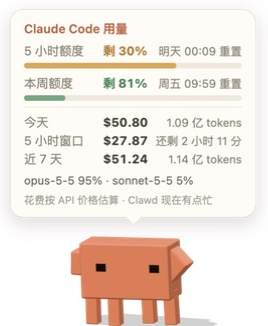

<p align="center">
  
</p>

<h1 align="center">Clawd 桌宠</h1>

<p align="center">住在 macOS 桌面上的 3D 小螃蟹 —— Claude Code 的吉祥物 Clawd，<br>会到处溜达、能拖能扔，还能告诉你 Claude Code 额度还剩多少。</p>

---

## 功能

**日常活动**
- 在屏幕底部自己溜达：横着走、左右张望、偶尔蹦一下、挥挥手
- 眼睛跟着鼠标转；鼠标停在它身上时，它会停下来看着你
- 随机眨眼，偶尔连眨两下或只眨一只眼

**互动**
- **点一下**：举起双手，头顶弹出用量气泡；气泡开着时再点一下就收起，它会跳一下
- **拖拽**：拎起来时手乱挥、腿乱蹬；松手会掉下来，甩得太猛会弹一下

**不挡你干活**
- 除了 Clawd 本身，其他地方的点击都直接穿透
- 光标只是路过 Clawd 时，它变半透明、点击也直接穿透到下面的 App；在它身上停留约 0.35 秒才变实、可以点和拖（同时停下来看着你）
- 光标在它附近忙活一阵，它会自己走开，给你让出地方
- 窗口不可聚焦：点它、拖它都不会抢走键盘，打字始终进入你当前的 App
- 菜单里可以开「完全穿透（只看不点）」：Clawd 完全不接收鼠标，只通过菜单互动

**常驻 & 收起**
- 菜单栏和 Dock 里都有 Clawd 图标
  - 左键点菜单栏图标：收起 / 放出 Clawd
  - 点 Dock 图标：收起时放出来，已经在外面就跳一下
  - 右键任一图标：打开完整菜单（各种动作、查看用量、自由活动、完全穿透、贴到屏幕边上、回到屏幕中间、开机自动启动、退出）
- 收起时 Clawd 蹦起来转一圈缩小消失，放出时从屏幕上方掉下来；收起期间不占 CPU / GPU

## Claude Code 用量

<p align="center"></p>

点 Clawd 或在菜单里选「查看用量」，头顶会弹出用量气泡：

| 内容 | 来源 |
|---|---|
| 5 小时额度 / 本周额度剩余百分比、重置时间 | 调用官方命令 `claude -p "/usage"`，与 Claude Code 里 `/usage` 显示的一致 |
| 今天、近 7 天、当前 5 小时窗口的花费和 token 数，各模型占比 | 读取本机 `~/.claude/projects/` 下的会话记录，按 Anthropic API 价格估算 |

- 额度查询只查额度，**不调用模型、不消耗额度、不留会话记录**；Clawd 本身**不读取任何登录凭证**
- 额度启动时查一次，之后每 5 分钟一次；点开气泡时，如果数据超过 1 分钟也会刷新
- 花费是按 API 价格的**估算**，用订阅套餐时实际不按这个扣费，只作为"用了多少"的参考
- 订阅额度只有 Pro / Max 订阅才有；用 API Key 时只显示花费估算

**Clawd 的状态会随剩余额度变化**（取 5 小时额度和本周额度里剩得更少的那个）：

| 剩余额度 | 状态 | 表现 |
|---|---|---|
| ≥ 50% | 精神饱满 | 正常活动 |
| 20% – 50% | 有点忙 | 偶尔冒汗，偶尔趴下歇一会 |
| 10% – 20% | 累了 | 眼睛半闭、走得慢、常打盹；头顶常驻橙色电量标「🔋 15%」 |
| < 10% | 快没电了 | 身体变灰暗、微微发抖、汗冒得很勤；电量标变红闪烁「🪫 6%」；每 15 分钟提醒一次 |
| 用完 | 额度用完了 | 一直趴着睡觉、身体更灰；电量标显示「🪫 0% · 00:10 恢复」 |

状态变差时 Clawd 会主动冒一句提示；额度重置恢复时会跳舞庆祝「额度恢复啦！🎉」。拿不到额度数据时（例如用 API Key），按当前 5 小时窗口的估算花费判断前三档（$8 / $25）。阈值在 [`clawd-pet/pet.js`](clawd-pet/pet.js) 的 `LEVEL_*` 常量里。

## 贴边模式

把 Clawd 拖到屏幕左 / 右边缘松手（或用力甩向边缘、或在菜单选「贴到屏幕边上」），它会侧过身扒在屏幕边上，大半个身子藏在屏幕外，只露出眼睛偷看，不走动、不挡东西。光标靠近时它会多探出来一点；点它照样能看用量；把它拖离边缘（或菜单「离开边缘」）就恢复正常。

## 安装与运行

需要 macOS（Apple 芯片）、Node.js，以及已登录的 [Claude Code](https://code.claude.com) 命令行（用于查询额度）。

```bash
cd clawd-pet
npm install
npm start            # 开发模式直接运行
```

打包成 `Clawd.app` 并装进「应用程序」：

```bash
cd clawd-pet
npm run package && ditto dist/Clawd-darwin-arm64/Clawd.app /Applications/Clawd.app
```

更新前先在菜单里退出正在运行的 Clawd。装进「应用程序」后，可以在菜单里勾选「开机自动启动」。

> App 没有签名。自己电脑上直接用没问题；发给别人时，对方第一次需要右键选「打开」。

### 开发自测

只在 `npm start`（未打包）时生效：

```bash
CLAWD_SELFTEST=1 npm start       # 4 秒后收起，8 秒后放出
CLAWD_SELFTEST=usage npm start   # 3 秒后弹出用量气泡
CLAWD_SELFTEST=cling npm start   # 3 秒后贴到屏幕边上
CLAWD_FAKE_QUOTA=7 npm start     # 假装 5 小时额度只剩 7%，用来看各档状态
```

单独检查用量统计：

```bash
cd clawd-pet && node usage.js
```

## 造型与动作的依据

- **造型**：按 Claude Code 程序里 Clawd 的四分块字符画逐像素还原，比例参考 Anthropic 官方 Clawd 动画（[@claudeai](https://x.com/claudeai) 发布的短片）——四条较长的腿、小方块眼睛、两侧短手臂
- **腿部动作**：腿是"髋 → 脚"的柱子，脚落地后钉在地面上；张望时身体前倾抬高、四条腿像平行四边形一样斜过去；走路时两组脚交替迈步；在空中时腿挂在身体下面晃荡，并限制伸缩长度
- **其他动作**：全部用阻尼弹簧过渡，有蓄力、挤压拉伸和落地回弹；起跳前快速下蹲、手往下压，参考了 [Codrops 对官方动画的逐帧拆解](https://tympanus.net/codrops/2026/05/05/reverse-engineering-claude-ais-mascot-animations-with-svg-and-gsap/)

## 项目结构

```
clawd/
├── clawd-pet/                 桌宠(Electron + three.js)
│   ├── main.js                主进程:透明置顶窗口、点击穿透、菜单栏 / Dock、用量调度
│   ├── preload.js             主进程与页面之间的接口
│   ├── index.html             页面与用量气泡样式
│   ├── pet.js                 3D 模型、动作、物理、互动、心情
│   ├── usage.js               本地用量统计 + 订阅额度查询
│   ├── trayTemplate*.png      菜单栏图标
│   └── build/                 应用图标(Blender 渲染脚本 + 合成脚本)
├── clawd.html                 网页版 3D Clawd(浏览器直接打开)
├── claude_figure.*            最早的 Blender 人偶(造型不是 Clawd,留作纪念)
└── docs/                      README 用的图片
```

重新生成应用图标（需要 Blender 和 Pillow）：

```bash
cd clawd-pet
/Applications/Blender.app/Contents/MacOS/Blender -b -P build/render_icon.py
python3 build/make_icon.py
```

## 说明

Clawd 是 Anthropic 的吉祥物。本项目是个人爱好作品，与 Anthropic 无关，仅供个人使用。
