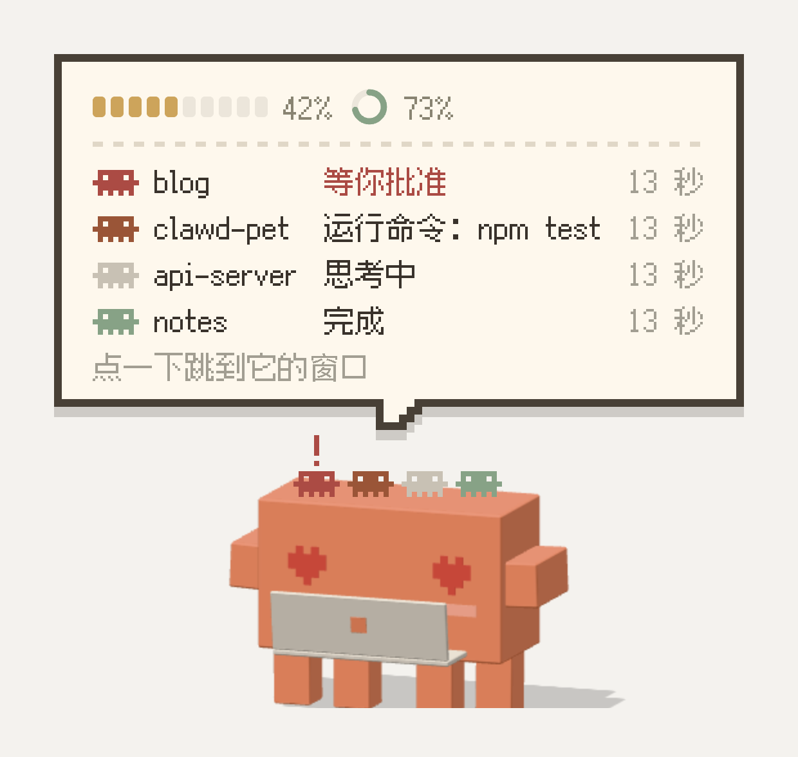
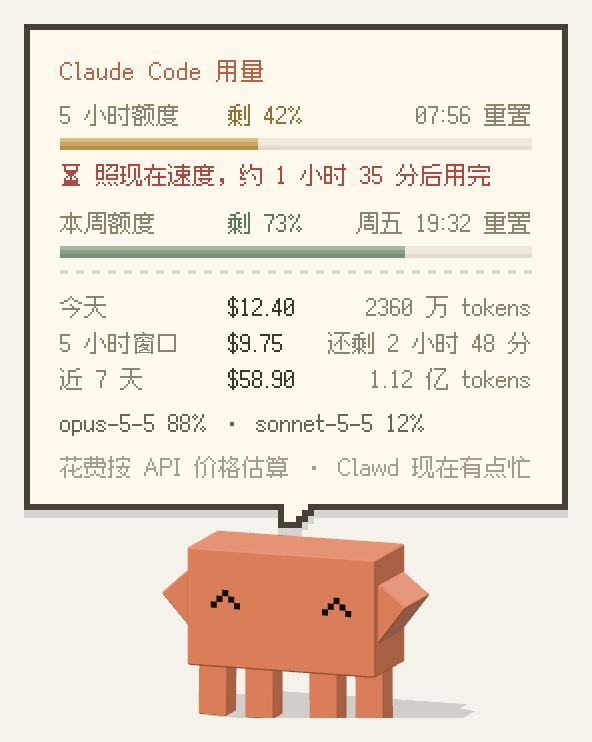
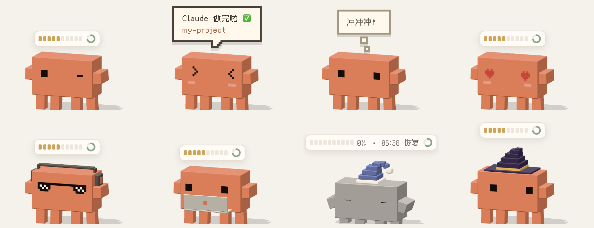

<p align="center">
  
</p>

<h1 align="center">Clawd Pet</h1>

<p align="center">
  <b>住在 macOS 桌面上的 3D 小 Clawd，替你盯着 Claude Code。</b><br>
  头顶趴着你的会话，Claude 需要你时拍拍你，测试通过时替你欢呼，<br>
  还告诉你额度还剩多少 —— 而且从不挡你干活。
</p>

<p align="center">
  
  
  
  
  <a href="LICENSE"></a>
</p>

<p align="center"><a href="README.md">English</a> · <b>简体中文</b> · <a href="README.ja.md">日本語</a></p>

<p align="center"></p>

## 为什么要养一只 Clawd？

你开了几个 Claude Code 会话，转头去忙别的，结果……其中一个已经等你批准等了 20 分钟。Clawd 就是来解决这个的，而且解决得挺可爱。简称 CP —— 你和 Claude，天生一对。

<table>
<tr><td width="200">🦀 <b>会话趴在头顶</b></td><td>每个正在跑的 Claude Code 会话是一只像素小螃蟹，趴在 Clawd 头顶。红色顶着 <code>!</code> 的在等你。光标停在 Clawd 上就能看到全部会话；<b>点一下小螃蟹，直接跳到那个终端标签页。</b></td></tr>
<tr><td width="200">✋ <b>在桌面上批准权限</b></td><td>Claude 要用工具时，在 Clawd 头顶的气泡里点允许 —— 或者直接按 <kbd>⌥⌘Y</kbd> / <kbd>⌥⌘N</kbd>。</td></tr>
<tr><td width="200">🔋 <b>额度一眼看清</b></td><td>像素血条显示 5 小时额度和本周额度。Clawd 的心情跟着走：额度充足就活蹦乱跳，快用完了就犯困。</td></tr>
<tr><td width="200">🎉 <b>看你干活做反应</b></td><td>测试通过撒彩纸，<code>git push</code> 火箭起飞，<code>rm -rf</code> 之前吓得发抖。</td></tr>
<tr><td width="200">💤 <b>帮你补课</b></td><td>你一走开 Clawd 就打盹；回来时告诉你错过了什么。</td></tr>
<tr><td width="200">🪶 <b>从不挡路</b></td><td>点击直接穿透，从不抢键盘焦点，也很省电。</td></tr>
</table>

一切都在本机运行。Clawd **不读取任何登录凭证**，查额度**不调用模型、不消耗额度**。

## 快速开始

需要 macOS（Apple 芯片），以及已登录的 [Claude Code](https://code.claude.com) 命令行（用于查询额度）。

### 下载安装

1. 从 [最新 Release](https://github.com/195286381/clawd-pet/releases/latest) 下载 `Clawd-<版本号>-macos-arm64.zip`，解压后把 `Clawd.app` 拖进「应用程序」
2. App 没有经过苹果公证，macOS 可能提示「已损坏」或「无法打开」。在终端里运行一次：
   ```bash
   xattr -dr com.apple.quarantine /Applications/Clawd.app
   ```
3. 打开 Clawd

### 从源码构建

另外需要 [Node.js](https://nodejs.org)。

```bash
git clone https://github.com/195286381/clawd-pet.git
cd clawd-pet/clawd-pet
npm install
npm run package && ditto dist/Clawd-darwin-arm64/Clawd.app /Applications/Clawd.app
open /Applications/Clawd.app
```

> 自己打包的 App 同样没有签名。在打包它的那台 Mac 上直接用没问题；拷到别的 Mac 上时，第一次需要右键选「打开」。

不想装、只想试试？在 `clawd-pet/` 里运行 `npm start` 就行。

### 初始设置

在 Clawd 的菜单里（右键菜单栏图标）：

1. **Claude Code → 连接 Claude Code（任务提醒）** —— 之后新开的会话就有小螃蟹、提醒和反应了
2. **设置 → 开机自动启动** —— 让 Clawd 一直在
3. 可选：**Claude Code → 在 Clawd 上批准权限**

> **界面语言：** 支持简体中文和英文，默认跟随系统语言，菜单 **语言 / Language** 里随时切换。

---

## 和 Claude Code 联动

### 会话小螃蟹

<p align="center"></p>

每个正在进行的 Claude Code 会话是一只像素小螃蟹，趴在 Clawd 头顶（最多 4 只，迷你尺寸最多 3 只；多的每个显示成一颗像素点，颜色同样表示状态）。等你处理的排在前面。

| 小螃蟹 | 意思 |
|---|---|
| 灰色 | 思考中 |
| 赭石色、轻轻颠 | 在干活 |
| 红色、头顶像素「!」、一蹦一蹦 | 等你批准 / 等你回复 |
| 绿色 | 刚做完 |
| 红色 | 出错停下了 |

小螃蟹的胖瘦表示这个会话的上下文用了多少：到自动压缩的 75% 胖一圈，90% 再胖一圈并冒汗（光标停在上面能看到百分比）。自动压缩的位置会参考你设置的 `CLAUDE_CODE_AUTO_COMPACT_WINDOW`。

- **光标停在 Clawd 或小螃蟹上**，弹出会话框：列出所有会话（包括做完在等你回复的）的标题（Claude App 侧边栏里的名字或 /rename 起的名字，没有就显示项目目录名）、在干什么、持续了多久。每行前面是一只和会话状态同色的像素小螃蟹，额度在最上面一行。一个会话都没有时只显示血条，拎着 Clawd 时什么都不弹。Clawd 正在说话时，它的对话框会先让开，会话框收起后再接着说完
- 你看的时候 Clawd 不会走开；光标移进框里，指着哪一行，对应的小螃蟹就抬起来一蹦一蹦

<p align="center"></p>

- **点一下小螃蟹，或框里的一行**（包括显示成像素点的会话），跳到那个会话：iTerm / Terminal 精确切到对应标签页（第一次会弹出 macOS 的「自动化」权限）；Claude App 直接打开那个会话；VS Code、Ghostty 等把那个 App 切到最前面。连接 Clawd 之前就开着的会话，重新打开一次就能跳了
- **Clawd 重启**（更新、开机自启）不会丢掉正在干活的会话：启动时读最近 30 分钟写过的会话记录，把还在调用工具或还在思考的会话补回头顶。补回来的小螃蟹在它下一个事件到来之前，点了只会切到对应的 App
- 做完和出错的小螃蟹 1 分钟后离开 —— 而且不是直接消失：

<p align="center"></p>

做完的会跳下头顶、挥挥手爬走；出错的会翻个肚皮扭两下再爬走。闲着时 Clawd 偶尔蹲一下，把头顶的小螃蟹颠起来。贴墙时小螃蟹跟着 Clawd 一起转。头顶有小螃蟹时 Clawd 不戴帽子，免得压住它们。可以在菜单 **Claude Code → 头顶显示会话小螃蟹** 里关掉。

### 提醒

**新开的** Claude Code 会话里：

- **Claude 在干活** —— Clawd 抱起小电脑陪你写；自言自语会说出 Claude 在做什么，例如「Claude 在运行命令：npm test…」
- **回复完成**（干了 15 秒以上的才提醒）—— Clawd 跳起来报告「Claude 做完啦 ✅」，带上项目名
- **需要你批准 / 在等你回复 / 有问题问你** —— Clawd 挥手提醒，例如「🙋 要用 Bash，需要你批准」
- **一直没处理** —— 3 分钟后再挥手催一下，之后每 5 分钟一次，最多 3 次
- **工具执行失败** —— Clawd 露出 `x x` 晕一下（不弹气泡，小失败很常见）
- **Claude 出错停下** —— Clawd 哭着提醒「⚠️ Claude 出错停下了」
- **上下文快满了**（90%）—— 每个会话提醒一次：「🦀 上下文快满了（92%），快要自动压缩」
- **压缩上下文** —— Clawd 头顶出现一个敞口纸箱，纸片一张张飞进去；压缩完封上胶带，Clawd 蹦一下，胖螃蟹瘦回来
- **你离开时的小结** —— 5 分钟没碰键盘鼠标，Clawd 就趴下睡觉；你一回来它告诉你错过了什么，例如「你不在的时候：🙋 api-server 等你批准，已经等了 12 分钟 / ✅ clawd 做完了」
- **好几条一起来** —— 挨着来的提醒合成一个气泡，一条接一条往下排；批准气泡开着时来的提醒先攒着，等你处理完再一起说

### 反应

<p align="center"></p>

| Claude 跑了… | Clawd 会… |
|---|---|
| 通过的测试（`npm test`、`pytest`、`go test`、`cargo test` 等） | 星星眼跳起来，撒彩纸 |
| 失败的测试 | 垂头哭脸 |
| 成功的 `git push` | 像火箭一样蹦起来，脚下冒烟 |
| `rm -rf` | 吓得发抖冒汗 |
| `git push --force` | 抖得更久，眼睛晕成一圈 |
| `git commit` | 开心地小跳一下 |
| `npm install`、`pip install` 等 | 头顶落下几个小纸箱 |
| 构建成功（`npm run build`、`cargo build`、`make` 等） | 跳一下，头顶闪星星 |
| 构建失败 | 垂头丧气，哭脸 |
| `docker build` / `run` / `up` | 眨眼，冒蓝泡泡 |
| `sudo` | 皱眉 |

同一种反应 15 秒内只来一次；贴墙、睡觉、被拖着时不反应。

### 在 Clawd 上批准权限

默认关闭，在菜单 **Claude Code → 在 Clawd 上批准权限** 里打开，之后新开的会话生效。

Claude 要用工具、需要你批准，而那个会话的窗口不在最前面时，Clawd 会冒出一个气泡，写着哪个项目要用什么工具（Bash 显示完整命令），带 **允许 / 拒绝 / 去终端处理** 三个按钮。按 <kbd>⌥⌘Y</kbd> 允许、<kbd>⌥⌘N</kbd> 拒绝（只在有待批准的请求时占用这两个键）。Claude Code 给出可用的规则时，还会多一个 **总是允许**，下面写着放行的规则和记在哪（例如 `Bash(npm test:*) · 这个项目`），和在终端里选「不再询问」一样。想拒绝并告诉 Claude 原因，就在最下面的框里写一句，按回车。多个请求一个一个来。Claude 问你选择题时，气泡里显示题目和选项：点一个选项就答；多选题点几个再按 **确定**；也可以在最下面的框里自己写回答，按回车提交。你正看着那个会话时 Clawd 不插手；60 秒没点、Clawd 收起或开着完全穿透时，交回 Claude Code 照常弹出确认。

### 连接是怎么做的

连接时 Clawd 会在 `~/.claude/settings.json` 里加几条 hooks：只追加自己的，原文件备份为 `settings.json.clawd-backup`，取消勾选就删掉这几条。除了批准权限要等你点按钮，其他 hooks 都在后台执行（`async`），不会拖慢 Claude Code：用 `curl` 把事件发到 `127.0.0.1:47615`，Clawd 没开着时立刻静默结束。每种提醒都能在同一个菜单里单独关掉。从旧版升级的，Clawd 启动时会自动补齐新增的 hooks。

---

## 用量和额度

<p align="center"></p>

点 Clawd（或菜单 **查看用量**），头顶弹出像素风用量面板（上图为示例数据）：

| 内容 | 来源 |
|---|---|
| 5 小时额度 / 本周额度剩余百分比、重置时间 | 官方命令 `claude -p "/usage"`，与 Claude Code 里 `/usage` 一致 |
| 今天、近 7 天、当前 5 小时窗口的花费和 token 数，各模型占比 | 本机 `~/.claude/projects/` 下的会话记录，按 Anthropic API 价格估算 |
| 最近的会话（最多 5 个）及状态和时长，点一行跳到那个会话 | Claude Code hooks，面板开着时每秒更新 |

- 额度查询**不调用模型、不消耗额度、不留会话记录**。启动时查一次，之后每 5 分钟一次（打开面板时，数据超过 1 分钟也会刷新）
- 花费是按 API 价格的**估算**，用订阅套餐时实际不按这个扣费
- 订阅额度只有 Pro / Max 才有；用 API Key 时只显示花费估算
- 光标停在面板上时面板不会收起
- **用完预测：** 按最近的速度，面板显示「约 40 分钟后用完」或「撑得到重置」；预计 45 分钟内用完时 Clawd 主动提醒一次

**头顶血条。** Clawd 头顶的 10 格是 5 小时额度，旁边的小圆环是本周额度。剩余不到 20% 显示百分比，不到 10% 闪烁；鼠标悬停时两个百分比都显示。有会话时，悬停 Clawd 会把额度并进会话框里显示。在 **外观 → 血条** 里选 **一直显示** / **鼠标悬停时显示** / **关闭**。

**心情跟着额度走**（取两个额度里剩得更少的那个）：

| 剩余 | 状态 | 表现 |
|---|---|---|
| ≥ 50% | 精神饱满 | 正常活动 |
| 20 – 50% | 有点忙 | 偶尔冒汗，偶尔趴下歇会 |
| 10 – 20% | 累了 | 眼睛半闭、走得慢、常打盹 |
| < 10% | 快没电了 | 颜色变暗、发抖、冒汗；每 15 分钟提醒一次 |
| 用完 | 额度用完了 | 先哭一下，然后戴上睡帽睡觉 |

额度重置时跳舞庆祝。拿不到额度数据时（API Key），前三档按 5 小时窗口的估算花费判断（$8 / $25）。阈值在 [`clawd-pet/pet.js`](clawd-pet/pet.js) 的 `LEVEL_*` 常量里。

**日报 / 周报。** 18 点以后 Clawd 第一次有空时，递上一张今天的小报：会话数、Claude 干活多久、测试通过次数、commit 和 push 次数、估算花费、最忙的项目；周五换成本周（周一到今天）的。用量面板的「今天」「近 7 天」下面也显示同样的统计。数据来自 hooks，保存在设置旁边的 `stats.json` 里，只留 14 天。可以在 **Claude Code → 下班时递日报(周五是周报)** 里关掉。

**休息提醒。** 连续使用 Claude Code 超过 60 分钟（可调），Clawd 伸个懒腰提醒你起来活动。Claude Code 停够 10 分钟，或者你离开键盘鼠标 10 分钟（哪怕 Claude 还在自己跑），都会重新计时；你不在时不提醒。

---

## 是宠物，不是小组件

<p align="center"></p>

- **住在桌面上** —— 在屏幕底部溜达、左右张望、蹦一下、挥挥手；眼睛跟着鼠标转
- **跟它玩** —— 点一下弹出用量面板；拎起来手脚乱挥；甩太猛会弹一下、晕一会儿；光标停在它身上会冒爱心眼；连戳 4 下会不耐烦
- **贴边模式** —— 拖到屏幕左 / 右边缘松手，它侧身扒在边上只露出眼睛偷看；光标靠近时多探出来一点
- **一堆表情** —— `> <`、`^ ^`、`x x`、墨镜、爱心眼、星星眼、`$ $`、哭哭、眨单眼…
- **道具** —— 睡帽、派对帽、耳机、陪你写代码时的小电脑、早上的咖啡；万圣节巫师帽、圣诞帽、春节红围巾
- **自言自语** —— 看时间、额度和你最近有多拼随口说几句，像素气泡，用 [方舟像素字体](https://github.com/TakWolf/ark-pixel-font)
- **可选 8-bit 音效** —— 现场合成的跳跃、落地、提醒音（默认关闭）
- **五种大小** —— 迷你 / 小 / 中 / 大 / 特大

### 不挡你干活

- 除了 Clawd 本身，其他地方的点击都直接穿透。光标只是路过时它变半透明；停留约 0.1 秒才变实、可以点
- 窗口**不可聚焦** —— 打字始终进入你当前的 App
- 光标在它附近忙活一阵，它会自己走开，给你让地方
- **完全穿透** 模式：Clawd 完全不接收鼠标
- **省电：** 只有动起来才跑 60 帧，站着 20 帧，睡觉 12 帧，用电池或开 **省电模式** 时上限 30 帧。M 系列 MacBook 实测：自由活动约 24% CPU，站着约 14%；收起时为零

<details>
<summary><b>完整菜单</b></summary>

菜单栏和 Dock 里都有 Clawd 图标（Dock 图标可以关掉）。左键点菜单栏图标收起 / 放出 Clawd；点 Dock 图标把它放出来或让它跳一下。右键任一图标打开完整菜单：

- 收起 / 放出 Clawd、查看用量
- **动作**：跳一下、打招呼、跳舞、探头张望、散散步、伸懒腰
- **位置**：贴到屏幕边上 / 离开边缘、回到屏幕中间
- **Claude Code**：连接 Claude Code（任务提醒）、回复完成时提醒、需要确认 / 等你输入时提醒、头顶显示会话小螃蟹、在 Clawd 上批准权限、下班时递日报
- **外观**：大小、血条、鼠标经过时（变半透明 / 稍微变淡 / 不变）、节日装扮
- **设置**：自言自语（话多 / 正常 / 安静 / 不说话）、休息提醒（关闭 / 45 / 60 / 90 分钟）、音效、省电模式、自由活动、完全穿透（只看不点）、在 Dock 中显示图标、开机自动启动
- **语言 / Language**：跟随系统 / 中文 / English
- 退出 Clawd（菜单栏图标里）

设置保存在 `~/Library/Application Support/Clawd/settings.json`。

</details>

<details>
<summary><b>出问题时</b></summary>

- 动画万一卡住，2 秒左右会自己恢复；页面崩溃会自动重新载入
- 报错记在 `~/Library/Application Support/Clawd/clawd.log`（只保留最近约 200 KB），反馈问题时附上这个文件
- 还是不对劲，从菜单栏图标退出再重新打开 Clawd
- 更新时先在菜单里退出 Clawd，再下载新版本、重复「下载安装」的步骤（自己从源码构建的，重新运行 `npm run package && ditto …` 那一行）

</details>

<details>
<summary><b>开发</b></summary>

```bash
cd clawd-pet
npm install
npm start
```

这些开关只在 `npm start`（未打包）时生效：

```bash
CLAWD_SELFTEST=1 npm start       # 4 秒后收起，8 秒后放出
CLAWD_SELFTEST=usage npm start   # 3 秒后弹出用量面板
CLAWD_SELFTEST=cling npm start   # 3 秒后贴到屏幕边上
CLAWD_SELFTEST=report npm start  # 3 秒后递今天的日报(report-week 是周报)
CLAWD_FAKE_QUOTA=7 npm start     # 假装 5 小时额度只剩 7%，用来看各档状态
CLAWD_FAKE_WEEK=30 npm start     # 假装本周额度只剩 30%，用来看血条旁的圆环
CLAWD_FAKE_QUOTA=30 CLAWD_FAKE_ETA=25 npm start   # 假装照现在速度 25 分钟后用完
CLAWD_HOOK_PORT=47616 npm start  # hooks 接口换个端口（桌面上的 Clawd 正开着时用）
CLAWD_CC_SETTINGS=/tmp/s.json npm start           # 「连接 Claude Code」改这个文件，不动真正的配置
CLAWD_DEMO=1 npm start           # 用一组固定的示例数据（README 截图用，不暴露真实用量）
CLAWD_LANG=en npm start          # 临时指定界面语言（en / zh），不改设置
```

单独检查用量统计：`cd clawd-pet && node usage.js`

```
clawd-pet/
├── clawd-pet/                 桌宠（Electron + three.js）
│   ├── main.js                主进程：透明置顶窗口、点击穿透、菜单栏 / Dock、用量调度、Claude Code hooks
│   ├── preload.js             主进程与页面之间的接口
│   ├── index.html             页面、像素风对话框 / 用量面板 / 血条样式
│   ├── pet.js                 3D 模型、动作、物理、互动、心情
│   ├── usage.js               本地用量统计 + 订阅额度查询
│   ├── trayTemplate*.png      菜单栏图标
│   ├── locales/en.json        英文界面文案（以中文原文为键）
│   ├── fonts/                 像素字体（方舟像素字体 12px 简体中文版 + OFL 授权）
│   └── build/                 应用图标（Blender 渲染脚本 + 合成脚本）、菜单栏图标生成脚本
├── README.md                  英文说明
├── README.zh-CN.md            中文说明
├── README.ja.md               日文说明
└── docs/                      README 用的图片（用 CLAWD_DEMO=1 的示例数据截取）
```

重新生成应用图标（需要 Blender 和 Pillow）：

```bash
cd clawd-pet
/Applications/Blender.app/Contents/MacOS/Blender -b -P build/render_icon.py
python3 build/make_icon.py
```

重新生成菜单栏图标（需要 Pillow）：`python3 build/make_tray.py`

</details>

<details>
<summary><b>造型与动作的依据</b></summary>

- **造型**：参考 Claude Code 程序里 Clawd 的四分块字符画、Anthropic 官方 Clawd 动画（[@claudeai](https://x.com/claudeai) 发布的短片）和 3D 打印版：方方正正、厚实的身体，两侧扁平的手臂，四条细腿两两成对（每条从前到后是一片薄板），小方块眼睛。腿比参考形象略长一些，走起来更灵动
- **腿部动作**：腿是「髋 → 脚」的柱子，脚落地后钉在地面上；张望时身体前倾、四条腿像平行四边形一样斜过去；走路时两组脚交替迈步；在空中时腿挂在身体下面晃荡，并限制伸缩长度
- **其他动作**：全部用阻尼弹簧过渡，有蓄力、挤压拉伸和落地回弹，参考了 [Codrops 对官方动画的逐帧拆解](https://tympanus.net/codrops/2026/05/05/reverse-engineering-claude-ais-mascot-animations-with-svg-and-gsap/)

</details>

## 说明

Clawd 是 Anthropic 的吉祥物。本项目是个人爱好作品，与 Anthropic 无关，也未获其认可。

气泡、用量面板和血条里的文字使用 [方舟像素字体（Ark Pixel Font）](https://github.com/TakWolf/ark-pixel-font) 12px 简体中文版，© TakWolf，以 [SIL Open Font License 1.1](clawd-pet/fonts/ark-pixel-OFL.txt) 授权。

## 参与贡献

欢迎提 bug、想法和 PR，详见 [CONTRIBUTING.md](CONTRIBUTING.md)（Issue 和 PR 用中文写也可以）。发现安全问题请按 [SECURITY.md](SECURITY.md) 私下报告。

## 许可证

代码以 [MIT License](LICENSE) 开源。Clawd 形象本身归 Anthropic 所有，不在本许可证范围内。
